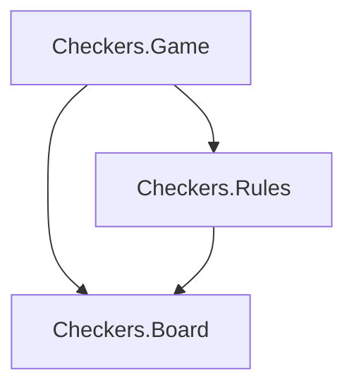

# Checkers Game Model — American Checkers

## Rules We Are Modeling

American Checkers (also called English Draughts):

- 8x8 board, only dark squares are used (32 playable squares)
- 12 pieces per side (dark moves first)
- Men move diagonally forward one square
- Men capture diagonally forward by jumping over an opponent piece to a vacant square
- If a capture is available, it is **mandatory**
- Multi-jumps: if after a jump another jump is available with the same piece, it must continue
- A man reaching the far row is promoted to a **king**
- Kings move and capture diagonally in **any** direction (forward or backward), one square at a time (no flying kings)
- A player wins by capturing all opponent pieces or leaving the opponent with no legal moves

## Architecture

Three modules in `lib/checkers/`:

- `**Checkers.Board**` — Board representation, piece placement, square coordinate helpers
- `**Checkers.Rules**` — Move generation, capture logic, promotion, win/draw detection
- `**Checkers.Game**` — Game state machine (tracks turn, move history, status) and the public API

## Module Design

### `Checkers.Board` — [lib/checkers/board.ex](lib/checkers/board.ex)

**Board representation:** A map from `{row, col}` positions to piece values. Rows 0-7, columns 0-7. Only the 32 dark squares are used (where `rem(row + col, 2) == 1`).

**Piece values:**

- `:dark` — dark man
- `:light` — light man
- `:dark_king` — dark king
- `:light_king` — light king

**Key functions:**

- `new/0` — returns a board with the standard starting position (dark on rows 0-2, light on rows 5-7)
- `piece_at/2` — get the piece at a position
- `put_piece/3` — place a piece at a position
- `remove_piece/2` — remove a piece from a position
- `move_piece/3` — move a piece from one position to another
- `dark_squares/0` — list of all 32 playable positions
- `pieces_by_color/2` — return all positions with pieces of a given color
- `color/1` — returns `:dark` or `:light` for any piece atom
- `king?/1` — returns true for king pieces
- `promote/1` — `:dark` to `:dark_king`, `:light` to `:light_king`

### `Checkers.Rules` — [lib/checkers/rules.ex](lib/checkers/rules.ex)

Pure functions that compute legal moves from a board + current turn.

**Move representation:**

- Simple move: `{from, to}`
- Jump (single): `{from, to, [captured_pos]}`
- Multi-jump: `{from, to, [captured_pos1, captured_pos2, ...]}`

**Key functions:**

- `legal_moves/2` — given a board and a color, returns all legal moves. If any captures exist, only captures are returned (mandatory capture rule).
- `simple_moves/2` — all non-capturing diagonal moves for a color
- `jumps/2` — all jump sequences (including multi-jumps) for a color
- `apply_move/2` — applies a move to a board, returns updated board (handles captures, promotion)
- `promotion_row/1` — returns 7 for `:dark`, 0 for `:light`
- `game_over?/2` — checks if the given color has no legal moves (loss)

### `Checkers.Game` — [lib/checkers/game.ex](lib/checkers/game.ex)

The top-level API and game state struct.

**Struct fields:**

- `board` — the current `Board` map
- `turn` — `:dark` or `:light` (dark moves first)
- `status` — `:playing`, `{:won, color}`, or `:draw`
- `moves` — list of moves made (for history)

**Key functions:**

- `new/0` — create a new game
- `move/2` — make a move, returns `{:ok, game}` or `{:error, reason}`
- `legal_moves/1` — convenience wrapper, returns legal moves for the current turn
- `status/1` — returns the current game status

## Tests

Three corresponding test files:

- [test/checkers/board_test.exs](test/checkers/board_test.exs) — board setup, piece placement, coordinate helpers
- [test/checkers/rules_test.exs](test/checkers/rules_test.exs) — move generation, captures, multi-jumps, promotion, mandatory capture, game-over detection
- [test/checkers/game_test.exs](test/checkers/game_test.exs) — full game flow: new game, making moves, turn switching, win detection, illegal move rejection

## Implementation Order

Build bottom-up: Board first, then Rules, then Game. Write tests alongside each module.