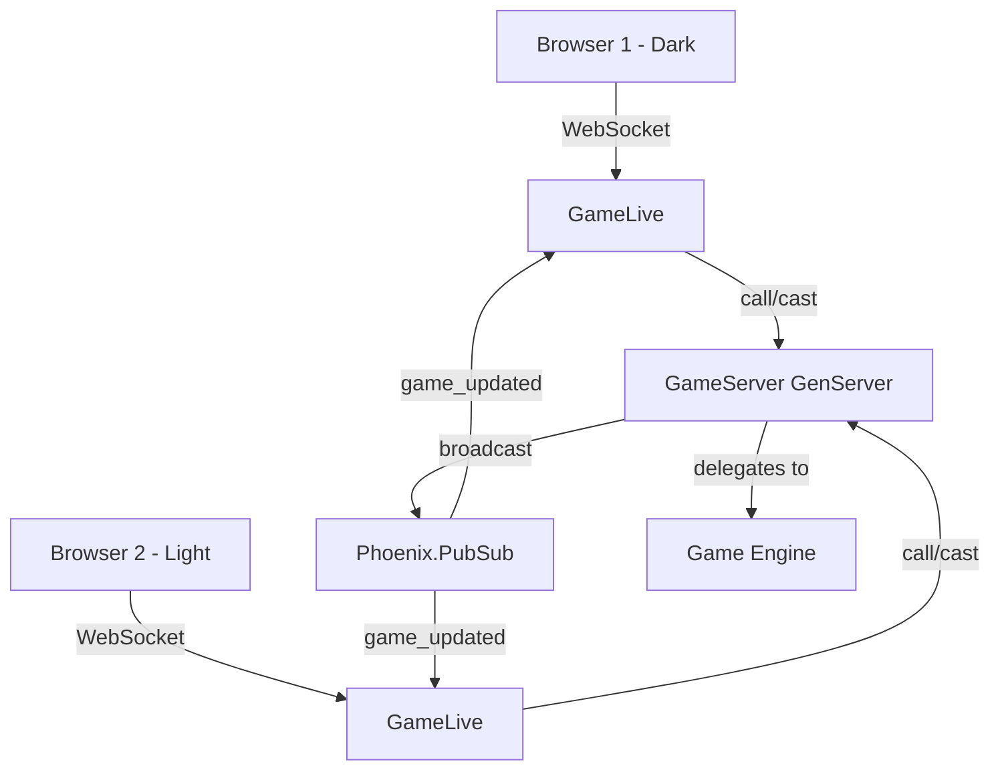

# LiveView Checkers Game

## Architecture

- **Single game URL**: `/game` — no multi-game support yet
- **Player assignment**: First to connect is dark, second is light. A random token stored in the LiveView session identifies each player across reconnects.
- **State management**: A single named `Checkers.GameServer` GenServer holds the `Game` struct. Supervised under a standard child in `application.ex`.
- **Real-time sync**: `Phoenix.PubSub` (already configured as `Checkers.PubSub`) broadcasts state changes to both connected LiveViews.

## Key Files to Create/Modify

### New files

- `lib/checkers/game_server.ex` — GenServer wrapping `Checkers.Game`, tracks player tokens, broadcasts via PubSub
- `lib/checkers_web/live/game_live.ex` — LiveView: renders board, handles click interactions, subscribes to PubSub
- `test/checkers_web/live/game_live_test.exs` — PhoenixTest-driven tests
- `test/checkers/game_server_test.exs` — Unit tests for the GenServer

### Modified files

- `lib/checkers/application.ex` — Add `GameServer` to supervision tree
- `lib/checkers_web/router.ex` — Add `live "/game", GameLive` route
- `lib/checkers/board.ex` — Add `Board.to_list/1` helper for rendering the 8x8 grid

## Implementation Plan (TDD)

### Phase 1: GameServer GenServer

- `GameServer.start_link/1` — starts with a fresh game
- `GameServer.get_state/0` — returns the current game + player assignments
- `GameServer.join/1` — accepts a player token, assigns dark (first) or light (second), returns color
- `GameServer.move/3` — accepts player_token, from, to; validates it's that player's turn; delegates to `Game.move/3`; broadcasts update via PubSub
- `GameServer.reset/0` — resets to a new game (handy for dev/testing)
- Broadcasts `{:game_updated, game_state}` on topic `"game"` after each successful move

### Phase 2: Board.to_list/1

- Returns all 64 squares as `[{position, piece_or_nil}, ...]` sorted by row then col, for easy grid rendering in the template

### Phase 3: GameLive LiveView

- On mount: generate/retrieve player token from session, call `GameServer.join/1`, subscribe to PubSub topic `"game"`
- Assigns: `game`, `player_color`, `selected_piece`, `legal_moves`
- **Board rendering**: 8x8 grid using Tailwind CSS. Dark squares are clickable. Pieces shown as circles (dark brown / cream). Kings get a crown indicator.
- **Interaction flow**:
  1. Click a piece (if it's your turn and the piece is movable) -> highlights it, shows legal move destinations
  2. Click a legal destination -> sends move to GameServer -> board updates via PubSub
  3. Click elsewhere -> deselects
- **Status display**: Whose turn it is, game result, "waiting for opponent" if only one player

### Phase 4: Router + Supervision

- Add `GameServer` as a child in `application.ex`
- Add `live "/game", GameLive` in the router (inside existing browser scope)
- Wire up session-based player token via `on_mount` or `mount` params

### Phase 5: PhoenixTest Tests

- Test board renders correctly
- Test clicking a piece highlights legal moves
- Test making a move updates the board
- Test turn enforcement (can't move opponent's pieces)
- Test two-player flow (two LiveView sessions playing against each other)

